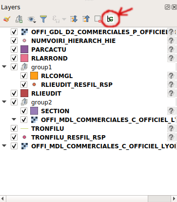
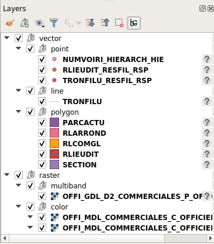
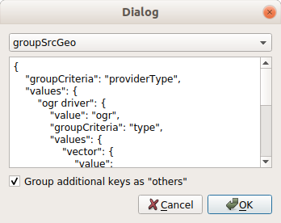

# QgisGroupLayers
QGIS plugin to group layers by type.

# Use of the plugin
After installing the plugin, a button is available in the toolbar of the Layers Docking Panel.

When pressing the button, all layers are grouped by type according to the selected ruleset.

When the button is pressed again, it is deselected and the layers tree returns to the previous layout.
__TODO:__ A hook must be added to reset the previous layout when layers are modified in the grouped view. Otherwise the ungroup action will overwrite all changes.

# Configuration
The plugin is configured via a dialog located at Menu -> Plugins -> Group Layers -> Select hierarchy definitions.

The definition tree is displayed for the selected ruleset.

The checkbox below changes the behaviour of attributes which are read in the layer tree, but which have not been configured in the ruleset. These "new" values are all added into the group "others" if the option is checked. If it is unchecked, each new property will be sorted into a new group.

TODO: give examples.

# Update of grouping rules
Grouping of layers is based on rules defined in a [python configuration file](groupLayers/groupTypes.py) of the rules by which the layers shall be grouped. The plugin contains a configuration dialog to choose among the predefined rulesets, but currently the source file has to be modified and the plugin reloaded if the user wants to implement a new ruleset. TODO: in the future, a modification could be implemented so that the ruleset can be edited in the configuration dialog.

The ruleset entrypoint is the python dict `groupHierarchies`. Each item in this dict can be selected and displayed in the configuration dialog by it's key.
Each of these sets is itself a recursive tree defining the grouping rules:
- On each level, the keyword `"groupCriteria"` designated the method to be applied to a Layer subclass to obtain the criteria value.
- The criterion method must exist for the given layer type.
  - _example_: `layer.geometryType()` only exists for vector layers, so this criterion must be used below a grouping by layer type (`layer.type()`) and only inside the value `QgsMapLayerType.VectorLayer`
  
